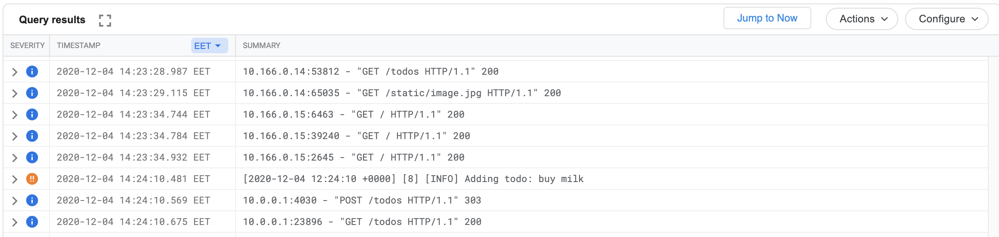

Prometheus
```
helm repo add prometheus-community https://prometheus-community.github.io/helm-charts
helm repo add stable https://charts.helm.sh/stable
kubectl create namespace prometheus
helm install prometheus-community/kube-prometheus-stack --generate-name --namespace prometheus
kubectl -n prometheus port-forward prometheus-kube-prometheus-stack-1607-prometheus-0 909
```

NATS
```
helm repo add nats https://nats-io.github.io/k8s/helm/charts/
helm install my-nats nats/nats
```

The app
```bash
docker build -t thangnv2212/todo-app . && docker push thangnv2212/todo-app

# inside folder broadcaster
docker build -t thangnv2212/todo-broadcaster . && docker push thangnv2212/todo-broadcaster

kubectl apply -k .
```

Go to localhost:8081/todos


### Exercise 3.10


