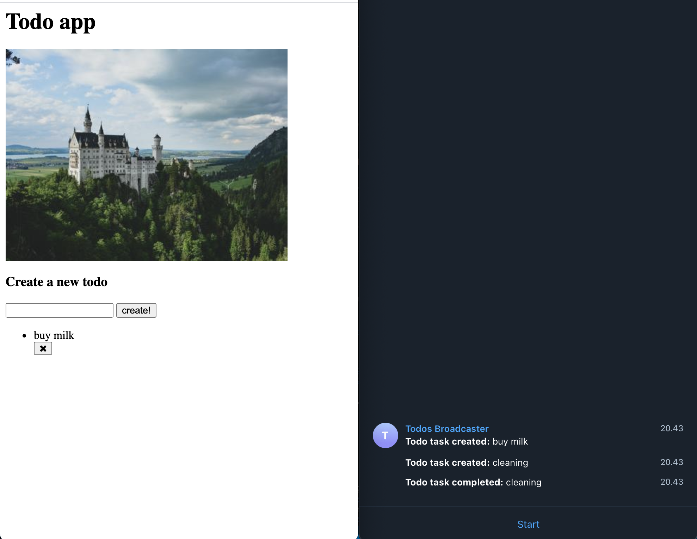

NATS
```
helm repo add nats https://nats-io.github.io/k8s/helm/charts/
helm install my-nats nats/nats --namespace todo-ns
```

```bash
docker build -t thangnv2212/todo-app . && docker push thangnv2212/todo-app

# inside folder broadcaster
docker build -t thangnv2212/todo-broadcaster . && docker push thangnv2212/todo-broadcaster

kubectl apply -k .
```

Go to localhost:8081/todos


