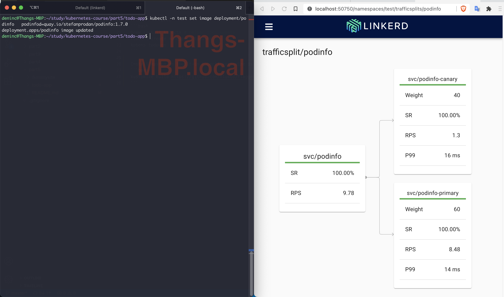

Create cluster
```bash
k3d cluster create --port '8082:30080@agent[0]' -p 8081:80@loadbalancer --agents 2 --k3s-server-arg '--no-deploy=traefik'
```

Install linkerd control plane resources
```bash
linkerd install | kubectl apply -f -
```

Install sealed secrets
```bash
brew install kubeseal
kubectl apply -f https://github.com/bitnami-labs/sealed-secrets/releases/download/v0.12.1/controller.yaml
# for all secrets in all projects
kubeseal -o yaml < secret.yaml > sealedsecret.yaml
```

Create namespace
```bash
brew install kubectx # helper tool kubens
kubectl create namespace todo-ns
kubens todo-ns
```

### Exercise 5.03: Learn from external material


*Flagger automated canary releases*

### Exercise 5.04: Platform comparison

Comparing OpenShift vs Rancher, I'd choose Rancher because:
- Rancher use vanilla Kubernetes -> no vendor lock-in
- Rancher's tools are open-sourced -> +1 moral point
- Enterprise support is cheaper

References:
https://www.kloia.com/blog/openshift-vs-rancher
https://ubuntu.com/kubernetes/compare